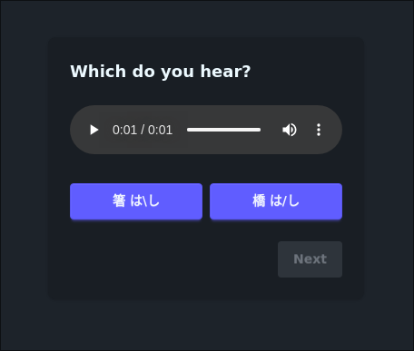

# minimal-pairs

A simple app for creating static minimal pairs tests

## Configuration

Edit the JSON file at src/data.json

```json
{
	"entries": [
		{
			"id": "1",
			"answerIndex": 2,
			"choice": {
				"audioUrl": "https://audio12.forvo.com/audios/mp3/9/o/9o_9478059_76_436794.mp3",
				"choices": [
					"箸 は\\し",
					"橋 は/し"
				]
			}
		},
		{
			"id": "2",
			"answerIndex": 1,
			"hearTest": {
				"text": "箸 は\\し",
				"audioUrls": [
					"https://audio12.forvo.com/audios/mp3/9/p/9p_9478059_76_436796.mp3",
					"https://audio12.forvo.com/audios/mp3/9/o/9o_9478059_76_436794.mp3"
				]
			}
		}
	]
}
```

There are as you can see two types of questions, choice where you hear a sound and have to pick which one is correct:



and hear test where you see a text and have to pick the correct one


## License

AGPLv3
